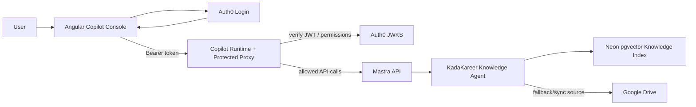
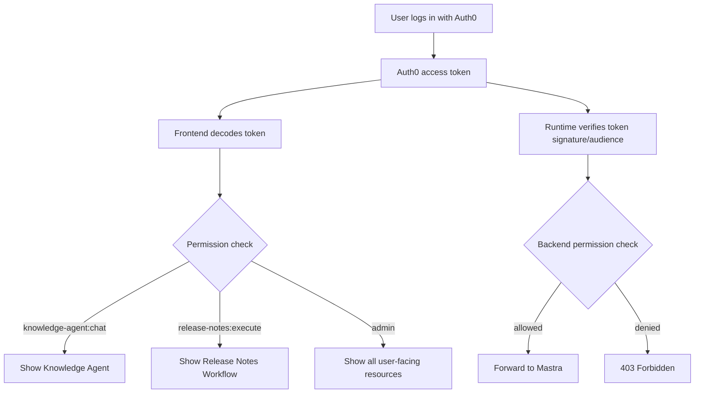
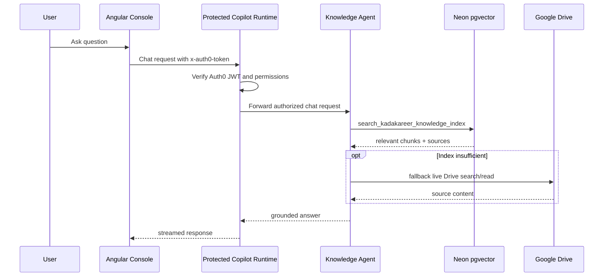

# KadaKareer Copilot Console Architecture

This document explains the KadaKareer Copilot Console, including the frontend, Auth0 authentication, permission-based access control, protected API proxy, CopilotKit chat runtime, Google Drive knowledge sync, and Neon-backed embedding index.

## Overview

The console is an Angular app that lets authenticated KadaKareer users chat with the KadaKareer Knowledge Agent and, when permitted, run internal workflows.

The system has four main runtime pieces:

- Angular console: `apps/copilot-console`
- CopilotKit runtime/proxy: `apps/copilot-console/copilot-runtime.ts`
- Mastra server: `src/mastra/index.ts`, served by `npm run dev`
- Neon/Postgres vector index: stores embedded Google Drive knowledge chunks

The browser never calls the raw Mastra API directly. It calls the protected Copilot runtime on port `8200`, which verifies Auth0 tokens and proxies allowed requests to Mastra on port `4111`.

## High-Level Flow



## Local Services

Run these services during local development:

```shell
# Root project: Mastra API and Studio
npm run dev
```

```shell
# apps/copilot-console: Auth0-protected Copilot runtime and proxy
npm run copilot-runtime
```

```shell
# apps/copilot-console: Angular dev server
ng serve
```

Default local URLs:

| Service | URL |
|---|---|
| Angular console | `http://localhost:4200` |
| Protected Copilot runtime/proxy | `http://localhost:8200` |
| Raw Mastra API/Studio | `http://localhost:4111` |

Do not expose the raw Mastra API publicly in production. Expose the protected runtime/proxy or put Mastra behind another Auth0-validating gateway.

## Authentication

The frontend uses Auth0 through `@auth0/auth0-angular`.

Auth config lives in:

```text
apps/copilot-console/src/app/auth0.config.ts
```

Current shape:

```typescript
export const auth0Config = {
  domain: 'dev-ew42azyb.us.auth0.com',
  clientId: '...',
  connection: 'Username-Password-Authentication',
  audience: 'http://localhost:4111/api',
  scope: 'openid profile email knowledge-agent:chat release-notes:execute admin',
};
```

The `audience` must exactly match the Auth0 API Identifier.

## Auth0 Dashboard Setup

### Application URLs

In the Auth0 application settings, configure:

```text
Allowed Callback URLs: http://localhost:4200
Allowed Logout URLs: http://localhost:4200
Allowed Web Origins: http://localhost:4200
```

The application should be a Single Page Application.

### Disable Public Signup

To make the console invite/admin-only:

```text
Authentication -> Database -> Username-Password-Authentication -> Settings -> Disable Sign Ups
```

Create users manually from:

```text
User Management -> Users -> Create User
```

### API and Permissions

Create an Auth0 API:

```text
Applications -> APIs -> Create API
Name: Local Mastra API
Identifier: http://localhost:4111/api
Signing Algorithm: RS256
```

Add these API permissions:

| Permission | Purpose |
|---|---|
| `knowledge-agent:chat` | Can see and chat with the KadaKareer Knowledge Agent |
| `release-notes:execute` | Can see and execute the release notes workflow |
| `admin` | Can see all user-facing agents and workflows |

Enable these API settings:

```text
Enable RBAC: ON
Add Permissions in the Access Token: ON
```

### Roles

Recommended roles:

| Role | Permissions |
|---|---|
| Knowledge Agent User | `knowledge-agent:chat` |
| Release Notes User | `release-notes:execute` |
| Console Admin | `admin` |

Assign roles from:

```text
User Management -> Users -> select user -> Roles
```

### Optional Post Login Action

If Auth0 does not include permissions in the access token, add a Post Login Action that copies roles/permissions into custom claims.

```javascript
exports.onExecutePostLogin = async (event, api) => {
  const namespace = 'http://localhost:4111/api/';
  const roles = event.authorization?.roles || [];
  const directPermissions = event.authorization?.permissions || [];
  const metadataPermissions = event.user.app_metadata?.permissions || [];

  const rolePermissions = {
    'Knowledge Agent User': ['knowledge-agent:chat'],
    'Release Notes User': ['release-notes:execute'],
    'Console Admin': ['admin'],
    'Administrator': ['admin'],
  };

  const permissions = [
    ...new Set([
      ...directPermissions,
      ...metadataPermissions,
      ...roles.flatMap(role => rolePermissions[role] || []),
    ]),
  ];

  api.accessToken.setCustomClaim(`${namespace}roles`, roles);
  api.accessToken.setCustomClaim(`${namespace}permissions`, permissions);
  api.idToken.setCustomClaim(`${namespace}roles`, roles);
  api.idToken.setCustomClaim(`${namespace}permissions`, permissions);
};
```

Attach it here:

```text
Actions -> Flows -> Login -> drag action into flow -> Apply
```

After changing Auth0 roles/actions, log out and log back in to receive a fresh token.

## Protected Runtime and Proxy

The protected runtime lives at:

```text
apps/copilot-console/copilot-runtime.ts
```

It does three jobs:

1. Serves CopilotKit chat routes under `http://localhost:8200/api/copilotkit/*`
2. Proxies Mastra API routes under `http://localhost:8200/api/mastra/*`
3. Verifies Auth0 JWTs and enforces permissions

### Route Protection

| Route | Auth Required | Notes |
|---|---:|---|
| `/api/copilotkit/info` | No | Public runtime discovery endpoint |
| `/api/copilotkit/agent/:agentId/run` | Yes | Requires matching agent permission |
| `/api/mastra/agents` | Yes | Response filtered by permissions |
| `/api/mastra/workflows` | Yes | Response filtered by permissions |
| `/api/mastra/workflows/:workflowId/*` | Yes | Requires `release-notes:execute` or `admin` |

The frontend uses `x-auth0-token` for CopilotKit chat requests so the Auth0 token is not forwarded as the standard `Authorization` header to OpenAI.

Mastra proxy calls use `Authorization: Bearer <token>`.

## RBAC Flow



## Frontend Permission Logic

The frontend decodes the Auth0 access token directly and extracts permissions from multiple possible claim locations:

- `permissions`
- `roles`
- `scope`
- `http://localhost:4111/api/permissions`
- `http://localhost:4111/api/roles`
- `https://kadakareer.com/permissions` (legacy support)
- `https://kadakareer.com/roles` (legacy support)

It maps role aliases to permissions:

| Role / Alias | Permission |
|---|---|
| `Administrator` | `admin` |
| `Admin` | `admin` |
| `Console Admin` | `admin` |
| `Knowledge Agent User` | `knowledge-agent:chat` |
| `Release Notes User` | `release-notes:execute` |

The backend still enforces permissions, so frontend visibility is not the security boundary.

## Knowledge Index

The Knowledge Agent answers from a Neon/Postgres `pgvector` index built from Google Drive.

Tools:

| Tool | Purpose |
|---|---|
| `sync_kadakareer_knowledge_index` | Reads Google Drive, chunks docs, embeds chunks, stores vectors |
| `search_kadakareer_knowledge_index` | Semantic search over indexed chunks |
| `get_kadakareer_knowledge_index_status` | Returns index status/counts |

Sync command:

```shell
npx mastra api --url http://localhost:4111 tool execute sync_kadakareer_knowledge_index '{"maxFiles":200,"forceRebuild":true}'
```

The frontend calls the sync/status tools through the protected proxy, not directly through `4111`.

## Knowledge Query Flow



## Google Drive Sync

Google Drive is the source of truth. Neon is the retrieval layer.

Required environment variables:

```shell
GOOGLE_CLIENT_ID=...
GOOGLE_CLIENT_SECRET=...
GOOGLE_REFRESH_TOKEN=...
GOOGLE_DRIVE_FOLDER_ID=...
OPENAI_API_KEY=...
NEON_DATABASE_URL=...
```

`GOOGLE_REFRESH_TOKEN` is used to mint Drive access tokens. If sync fails with `invalid_grant`, regenerate the refresh token.

## Runbook

### Start local development

```shell
# Terminal 1: root
npm run dev
```

```shell
# Terminal 2: apps/copilot-console
npm run copilot-runtime
```

```shell
# Terminal 3: apps/copilot-console
ng serve
```

### Check protected runtime

```shell
curl -i http://localhost:8200/api/copilotkit/info
```

Should return `200`.

```shell
curl -i http://localhost:8200/api/mastra/agents
```

Without a token, should return `401`.

### Rebuild the Angular console

```shell
cd apps/copilot-console
npm run build -- --configuration development
```

## Troubleshooting

### User logs in but sees no agents/workflows

Check the access token contains permissions:

```json
{
  "permissions": ["admin"]
}
```

or:

```json
{
  "http://localhost:4111/api/permissions": ["admin"]
}
```

If missing, enable Auth0 RBAC and Add Permissions in Access Token, or use the Post Login Action above.

### Copilot chat reaches OpenAI with invalid issuer

Do not send Auth0 tokens in the standard `Authorization` header for CopilotKit chat. The console uses `x-auth0-token` for chat and the runtime validates it before invoking agents.

### Release notes or internal processor appears unexpectedly

The frontend hides internal resources by ID. The proxy also supports:

```text
excludeAgentIds=...
excludeWorkflowIds=...
```

Internal hidden workflow:

```text
knowledge-base-agent-input-processor
```

### Neon tables exist but have no records

Run the sync tool successfully. Tables are created on startup/schema init, but records appear only after sync.

```shell
npx mastra api --url http://localhost:4111 tool execute sync_kadakareer_knowledge_index '{"maxFiles":200,"forceRebuild":true}'
```
